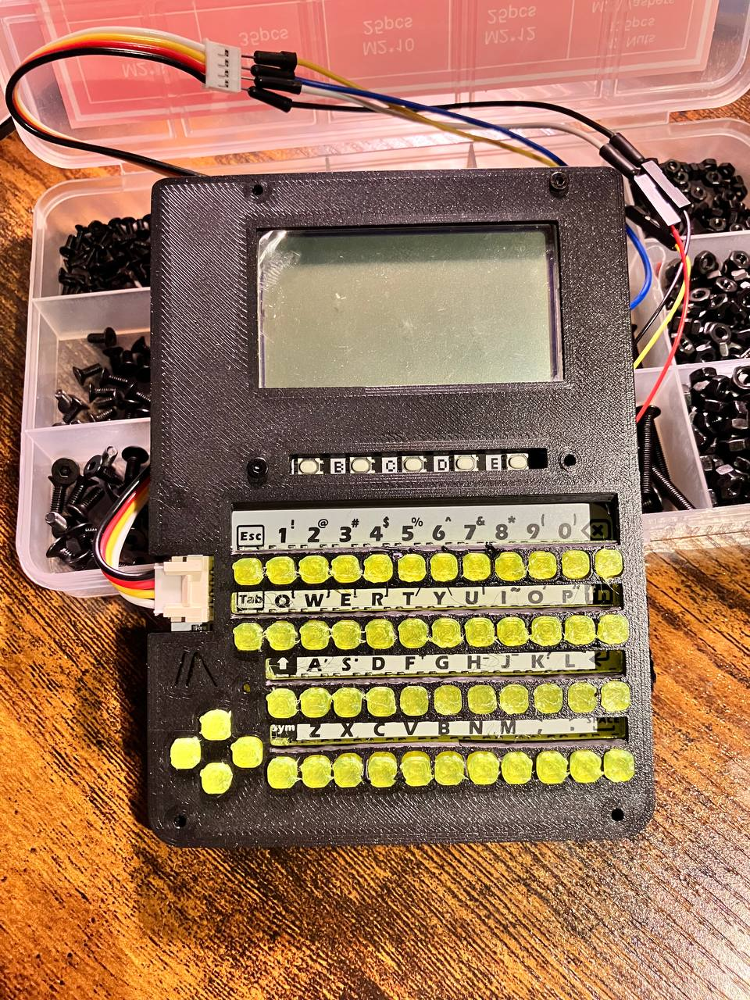
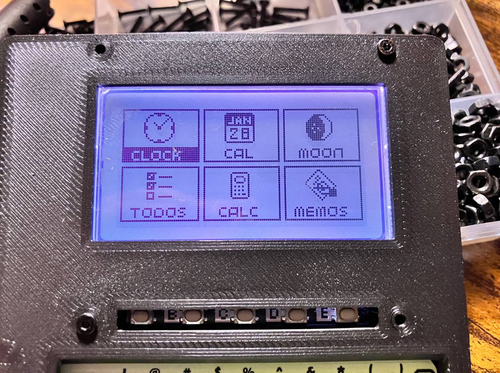
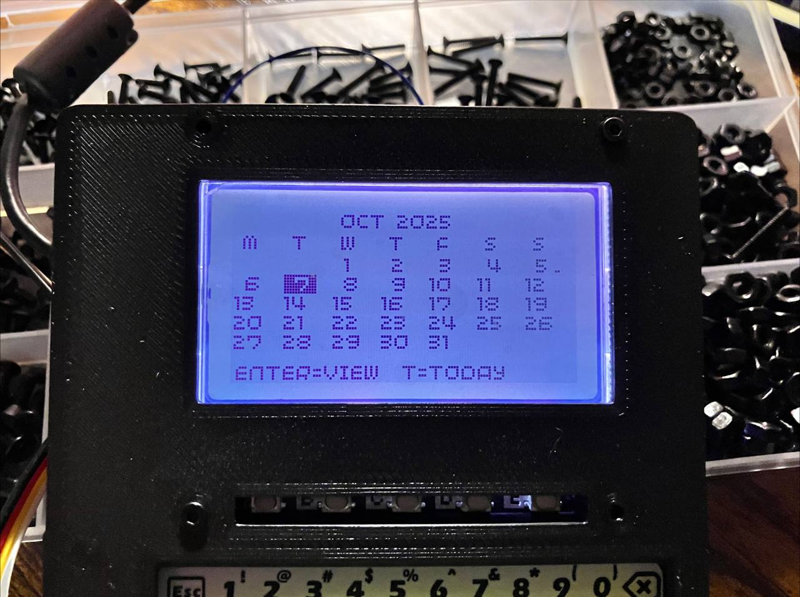
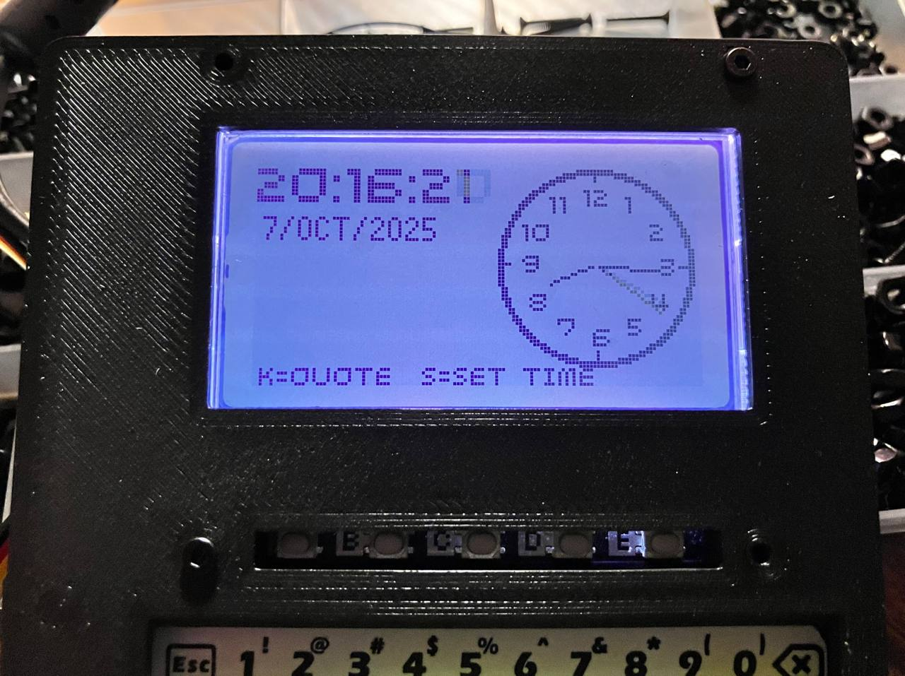
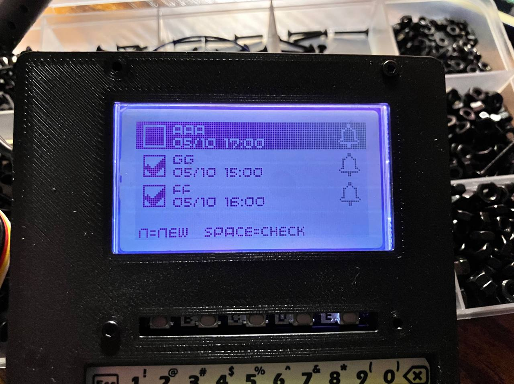

# LCD-GFX: MicroPython Icon-Based Menu System 80's style with a Raspberry Pi Pico and 3D printed case

A beautiful, modular icon-based menu system for MicroPython, designed for the **Pimoroni GFX Pack** (128x64 LCD) with **CardKB** input. This project provides a feature-rich personal 80's style digital assistant experience on a Raspberry Pi Pico, with multiple apps including clock, calendar, calculator, contacts, games, weather, and more.


### ⚠️ Disclaimer and early design pictures
The project is under development. I am designing the case with Tinkercad. Here you can check some super-ultra-early pictures of the tentative design of the app and the case. As you can see, is far from being finished. I used this project as a base to build the keyboard plate and keycaps (Creative Commons (4.0 International License) Attribution-NonCommercial) https://www.printables.com/model/811577-textmesh-heltec-v3-edition:





---

## 📋 Table of Contents

- [Overview](#overview)
- [Hardware Requirements](#hardware-requirements)
- [Features](#features)
- [Project Architecture](#project-architecture)
- [Image Crafting](#image-crafting)
- [Installation & Setup](#installation--setup)
- [Development Workflow](#development-workflow)
- [Code Organization](#code-organization)
- [Available Apps](#available-apps)
- [Themes & Customization](#themes--customization)
- [Future Roadmap](#future-roadmap)
- [Contributing](#contributing)
- [Troubleshooting](#troubleshooting)
- [License](#license)

---

## 🎯 Overview

**LCD-GFX** is a fully-featured MicroPython application framework that transforms a Raspberry Pi Pico with a GFX Pack display into a portable, retro-style personal digital assistant. The system features:

- **Icon-based navigation menu** with a clean, intuitive interface
- **Modular app architecture** for easy extensibility
- **Persistent data storage** for contacts, memos, todos, and settings
- **Theme system** with multiple color schemes (amber, green phosphor, ice blue, white, red)
- **Real-time clock** with analog and digital displays
- **Weather integration** via OpenWeather API (under development)
- **Games** including Snake and Maze
- **Productivity apps** like calculator, calendar, todos, and memos

The project emphasizes clean code organization, modularity, and ease of deployment, making it both a practical tool and an excellent learning resource for MicroPython development.

---

## 🛠️ Hardware Requirements

### Essential Components

| Component | Description | Link |
|-----------|-------------|------|
| **Raspberry Pi Pico** | RP2040-based microcontroller | [Pimoroni](https://shop.pimoroni.com/products/raspberry-pi-pico) |
| **GFX Pack** | 128x64 LCD display with buttons | [Pimoroni GFX Pack](https://shop.pimoroni.com/products/pico-gfx-pack) |
| **CardKB** | I2C mini keyboard (M5Stack) | [M5Stack CardKB](https://shop.m5stack.com/products/cardkb-mini-keyboard) |

### Optional Components

- **USB-C cable** for power and programming
- **Portable battery pack** for mobile use
- **3D printed case** (STL files coming soon!)

### Wiring

The CardKB connects via I2C:
- **SDA** → GPIO 4 (Pin 6)
- **SCL** → GPIO 5 (Pin 7)
- **GND** → Ground
- **VCC** → 3.3V

---

## ✨ Features

### 🏠 Main Menu
- **Icon-based grid interface** with smooth navigation
- **Customizable app icons** (16x16 pixel art)
- **Multi-page support** with pagination
- **Arrow key navigation** for intuitive control

### ⏰ Clock App
- **Analog clock** with hour markers and hands
- **Digital time display** with 12/24-hour format toggle
- **Date display** with month names
- **Daily inspirational quotes** with popup modal
- **Set time functionality** for initial configuration

### 📅 Calendar App
- **Monthly view** with weekday labels
- **Current day highlighting**
- **Week number display**
- **Navigation** between months and years

### 🧮 Calculator App
- **Basic arithmetic** (+, -, ×, ÷)
- **Decimal support**
- **Clear and backspace** functions
- **Large display** for easy reading

### 📞 Contacts App (not fully implemented yet)
- **Add/edit/delete contacts** with name and phone
- **Persistent storage** in JSON format
- **Scrollable list view**

### 📝 Memos & Todos
- **Quick text notes** with timestamps
- **Todo list** with checkboxes
- **Edit and delete** functionality
- **Data persistence** across reboots

### 🎮 Games (not fully implemented yet)
- **Snake** - Classic snake game with score tracking
- **Maze** - Navigate through procedurally generated mazes

### 🌤️ Weather App (not fully implemented yet)
- **Real-time weather data** from OpenWeather API
- **Current conditions** (temperature, humidity, pressure)
- **3-day forecast** with weather icons
- **Auto-refresh** every 10 minutes
- **Custom city selection**

### 🌙 Moon Phase (not fully implemented yet)
- **Current moon phase** visualization
- **Phase name** (New Moon, Full Moon, etc.)
- **Illumination percentage**
- **Beautiful pixel art icons** for each phase

### ⚙️ Settings
- **Theme chooser** with live preview
- **Brightness control** for backlight
- **Clock format** (12h/24h) toggle
- **Weather configuration** (API key, city)
- **Time zone offset** configuration

---

## 🏗️ Project Architecture

### Core Components

The project follows a clean, modular architecture:

```
lcd-gfx/
├── main.py                 # Application entry point
├── core/                   # Core framework modules
│   ├── __init__.py        # Module exports
│   ├── context.py         # Global context, settings, data storage
│   ├── ui.py              # UI helper functions (fonts, drawing)
│   ├── input.py           # CardKB input handling
│   └── utils.py           # Utility functions
├── apps/                   # Application modules
│   ├── __init__.py        # App exports
│   ├── base.py            # Base App class, AppManager, IconMenu
│   ├── clock.py           # Clock application
│   ├── calculator.py      # Calculator application
│   ├── calendar.py        # Calendar application
│   ├── contacts.py        # Contacts application
│   ├── memos.py           # Memos application
│   ├── todos.py           # Todo list application
│   ├── games.py           # Games (Snake, Maze)
│   ├── moonphase.py       # Moon phase display
│   ├── weather.py         # Weather application
│   ├── weather_settings.py # Weather configuration
│   ├── settings.py        # Settings application
│   ├── theme_chooser.py   # Theme selection
│   ├── w_brightness.py    # Brightness control
│   └── settime.py         # Time setting utility
├── assets/                 # Static assets
│   ├── images/            # PNG source images
│   ├── quotes.txt         # Daily inspirational quotes
│   └── png2rows.py        # Image conversion tool
├── deploy.sh              # Intelligent deployment script
├── pico-utils.sh          # Utility scripts for Pico management
└── agenda.json            # Persistent data storage (on Pico)
```

### Design Patterns

#### 1. **App-Based Architecture**
All applications inherit from the base `App` class:

```python
class App:
    title = "App"
    tick_ms = 200  # Refresh rate
    
    def draw(self, ctx):
        # Render the app
        pass
    
    def handle_key(self, ctx, k):
        # Handle keyboard input
        return None  # or "pop", ("push", new_app)
```

#### 2. **Context Pattern**
A global `Context` object provides access to:
- Display (`ctx.d`)
- Hardware interfaces (I2C, RTC)
- Settings and data storage
- Theme management

#### 3. **Stack-Based Navigation**
The `AppManager` uses a stack to manage app navigation:
- `push(app)` - Navigate to a new app
- `pop()` - Return to previous app
- Stack bottom is always the main menu

#### 4. **Data Persistence**
All data is stored in `agenda.json` on the Pico's filesystem:

```json
{
  "contacts": [...],
  "memos": [...],
  "todos": [...],
  "settings": {
    "theme": "amber",
    "w_brightness": 64,
    "clock_24h": true,
    "weather_city": "Madrid",
    "openweather_api_key": "..."
  }
}
```

---

## 🎨 Image Crafting

One of the unique aspects of this project is the custom image conversion pipeline for creating pixel art icons.

### The PNG to Binary Pipeline

Icons are created as PNG images and converted to MicroPython-compatible binary arrays using `png2rows.py`:

#### Step 1: Create PNG Icon
Create a 16x16 (or 32x32) PNG image with transparency:
- **Black pixels** → Will be drawn (pen=1)
- **White/transparent** → Will be skipped (pen=0)

#### Step 2: Convert to Binary Array
Run the conversion tool:

```bash
python assets/png2rows.py assets/images/clock.png 16 16
```

#### Step 3: Output Format
The tool generates a binary array ready for MicroPython:

```python
ICON = [
  0b0000011111100000,
  0b0001100110011000,
  0b0010000000000100,
  0b0100000000001010,
  0b0100000000010010,
  0b1000010000100001,
  0b1000001001000001,
  0b1100000110000011,
  0b1100000110000011,
  0b1000000000000001,
  0b1000000000000001,
  0b0100000000000010,
  0b0100000000000010,
  0b0010000000000100,
  0b0001100110011000,
  0b0000011111100000,
]
```

#### Step 4: Render in App
Use the icon in your app's `draw_icon()` method:

```python
def draw_icon(self, ctx, x, y, w, h):
    icon = ICON  # Your converted icon
    start_x = x + (w - 16) // 2  # Center horizontally
    start_y = y + (h - 16) // 2  # Center vertically
    
    for row, bits in enumerate(icon):
        for col in range(16):
            if bits & (1 << (15 - col)):  # Check if bit is set
                ctx.d.pixel(start_x + col, start_y + row)
```

### Image Guidelines

- **Resolution**: 16x16 for menu icons, 32x32 for larger graphics
- **Format**: PNG with alpha channel
- **Style**: High contrast, simple shapes work best
- **Colors**: Binary (on/off), intermediate grays are ignored
- **Tools**: Any pixel art editor (Aseprite, Piskel, GIMP, Photoshop)

### Icon Library

All icon source images are stored in `assets/images/`:
- `clock.png` - Clock app icon
- `calc.png` - Calculator icon
- `cal.png` - Calendar icon
- `tel.png` - Contacts icon
- `memo.png` - Memos icon
- `bell.png` - Todos icon
- `gear.png` - Settings icon
- `games.png` - Games icon
- `moon.png` - Moon phase icon
- `moonphases/` - 8 moon phase images

---

## 🚀 Installation & Setup

### Prerequisites

1. **MicroPython firmware** on your Raspberry Pi Pico
   - Download from [micropython.org](https://micropython.org/download/rp2-pico/)
   - Flash using Thonny or `picotool`

2. **Required libraries** (included with Pimoroni MicroPython builds):
   - `gfx_pack` - Display driver
   - `machine` - Hardware access
   - `ujson` - JSON parsing

3. **Development tools** on your computer:
   ```bash
   pip install adafruit-ampy
   ```

### Quick Start

#### 1. Clone the Repository
```bash
git clone https://github.com/yourusername/lcd-gfx.git
cd lcd-gfx
```

#### 2. Connect Your Hardware
- Plug in the GFX Pack to your Raspberry Pi Pico
- Connect the CardKB via I2C
- Connect Pico to your computer via USB

#### 3. Configure Serial Port
```bash
# Linux/Mac
sudo chmod 666 /dev/ttyACM0

# Or add yourself to dialout group (permanent)
sudo usermod -a -G dialout $USER
# Then logout/login
```

#### 4. Deploy to Pico
```bash
./deploy.sh
```

The deployment script will:
- ✅ Check for `ampy` installation
- ✅ Create necessary directories on Pico
- ✅ Upload only changed files (intelligent caching)
- ✅ Verify successful deployment

#### 5. Reset and Run
```bash
# Option A: Use utility script
./pico-utils.sh reset

# Option B: Connect to REPL and press Ctrl+D
screen /dev/ttyACM0 115200
# Press Ctrl+D to soft reset
```

### Initial Configuration

On first boot, configure:
1. **Set time**: Navigate to Clock → Press 'S' → Enter current date/time
2. **Choose theme**: Settings → Theme → Select your preferred color
3. **Weather API** (optional): Settings → Weather → Enter API key and city

---

## 💻 Development Workflow

### Day-to-Day Development

```bash
# 1. Edit your code
nano apps/clock.py

# 2. Deploy changes (only uploads modified files)
./deploy.sh

# 3. Reset Pico
./pico-utils.sh reset

# 4. View logs (optional)
./pico-utils.sh repl
```

### Useful Commands

```bash
# List files on Pico
./pico-utils.sh ls

# View file tree
./pico-utils.sh tree

# Backup entire Pico
./pico-utils.sh backup

# Force re-upload all files
./deploy.sh --force

# Use different serial port
./deploy.sh --port /dev/ttyUSB0

# Clean Pico (⚠️ deletes everything!)
./pico-utils.sh clean
```

### Development Tips

1. **Test locally first**: Many parts can be tested with regular Python
2. **Use the cache**: The `.deploy_cache` speeds up deployment
3. **Check syntax**: `python -m py_compile apps/myapp.py`
4. **Incremental testing**: Test each app individually
5. **Keep backups**: Run `./pico-utils.sh backup` before major changes

### Creating a New App

1. Create a new file in `apps/`:

```python
# apps/myapp.py
from apps.base import App
from core.ui import cls, header, use_font

class MyApp(App):
    title = "My App"
    tick_ms = 200
    
    def draw_icon(self, ctx, x, y, w, h):
        # Draw 16x16 icon centered in w×h space
        # Use png2rows.py to convert PNG images
        pass
    
    def draw(self, ctx):
        cls(ctx)
        header(ctx, self.title)
        # Your drawing code here
    
    def handle_key(self, ctx, k):
        if k in (ord('q'), 27):  # q or ESC
            return "pop"
        # Handle other keys
        return None
```

2. Export in `apps/__init__.py`:

```python
from .myapp import MyApp
__all__ = [..., 'MyApp']
```

3. Add to menu in `main.py`:

```python
entries = [
    # ... existing apps
    {"name": "My App", "app": MyApp()},
]
```

4. Deploy and test:

```bash
./deploy.sh
./pico-utils.sh reset
```

---

## 📦 Code Organization

### Core Modules

#### `core/context.py`
- **Context**: Main application context with hardware access
- **DataStore**: JSON-based persistent storage
- **ThemeManager**: Theme configuration and application
- **THEMES**: Pre-defined color schemes

#### `core/ui.py`
- `use_font(ctx, size)` - Change display font
- `cls(ctx)` - Clear screen
- `header(ctx, title)` - Draw title bar
- `rect_frame(ctx, x, y, w, h, thickness)` - Draw rectangle outline
- `draw_ring(ctx, cx, cy, radius, thickness)` - Draw circle outline

#### `core/input.py`
- `read_key(ctx)` - Read keyboard input from CardKB
- Returns ASCII code or special key codes (0xB4-0xB7 for arrows)

#### `core/utils.py`
- Utility functions for text wrapping, formatting, etc.

### App Modules

#### `apps/base.py`
- **App**: Base class for all applications
- **AppManager**: Stack-based app navigation manager
- **IconMenu**: Grid-based icon menu with pagination

Each app module (`clock.py`, `calculator.py`, etc.) provides:
- App class with `draw()` and `handle_key()` methods
- Optional `draw_icon()` for menu representation
- Self-contained logic and state

### Data Flow

```
User Input (CardKB)
    ↓
read_key(ctx)
    ↓
AppManager.run() loop
    ↓
current_app.handle_key(ctx, key)
    ↓
Actions: "pop", ("push", new_app), or None
    ↓
current_app.draw(ctx)
    ↓
ctx.d.update() → Display
```

### State Management

- **Settings**: Stored in `agenda.json`, loaded at startup
- **App state**: Stored as instance variables in app objects
- **Navigation state**: Managed by AppManager's stack
- **Persistent data**: Contacts, memos, todos stored in `agenda.json`

---

## 📱 Available Apps

| App | Description | Key Features |
|-----|-------------|-------------|
| **Clock** | Analog/digital clock | Daily quotes, time setting, 12/24h format |
| **Calendar** | Monthly calendar view | Month/year navigation, current day highlight |
| **Moon Phase** | Current moon phase | 8 phases with names, illumination % |
| **Todos** | Task list manager | Add/delete/check tasks, persistence |
| **Calculator** | Basic calculator | +, -, ×, ÷, decimals, clear |
| **Memos** | Quick notes | Add/view/delete notes with timestamps |
| **Contacts** | Phone book | Add/edit/delete contacts, search |
| **Games** | Snake & Maze | Score tracking, difficulty levels |
| **Settings** | Configuration | Theme, brightness, time format, weather |
| **Weather** | Weather forecast | Current conditions, 3-day forecast, auto-refresh |

---

## 🎨 Themes & Customization

### Available Themes

| Theme | Description | R | G | B | W |
|-------|-------------|---|---|---|---|
| **Amber** | Classic warm orange (default) | 64 | 32 | 0 | 20 |
| **Fosforo** | Green phosphor terminal | 0 | 64 | 0 | 20 |
| **Hielo** | Ice blue | 0 | 0 | 64 | 24 |
| **Blanco** | Pure white | 0 | 0 | 0 | 64 |
| **Rojo** | Red alert | 64 | 0 | 0 | 16 |

### Changing Themes

**Via Settings Menu:**
1. Open **Config** app
2. Select **Theme**
3. Choose theme and press Enter
4. Brightness adjusts automatically

**Programmatically:**
```python
ctx.settings["theme"] = "fosforo"
ctx.theme.apply()
```

### Creating Custom Themes

Edit `core/context.py`:

```python
THEMES = {
    "mytheme": dict(r=32, g=16, b=64, w=30),
    # r, g, b = RGB backlight (0-255)
    # w = White LED brightness (0-255)
}
```

---

## Future Roadmap

### High Priority
- [ ] **Contacts App** - Add/edit/delete contacts with name and phone
- [ ] **Memos App** - Add/view/delete notes with timestamps
- [ ] **Todos App** - Add/delete/check tasks, persistence
- [ ] **Games App** - Snake and Maze
- [ ] **Weather App** - Real-time weather data from OpenWeather API
- [ ] **Moon Phase App** - Current moon phase visualization
- [ ] **Settings App** - Configuration
- [ ] **3D Printed Case** - Custom enclosure design
- [ ] **WiFi Configuration UI** - Setup wizard for network credentials
- [ ] **Stopwatch & Timer** - Time tracking utilities

### Medium Priority

- [ ] **Power Management** - Sleep mode, battery monitoring

### Long Term

### Hardware Expansions

- [ ] **RTC Module** - DS3231 for accurate timekeeping
- [ ] **SD Card** - Expand storage for media files
- [ ] **Temperature Sensor** - Local weather data
- [ ] **Buzzer** - Audio alerts and beeps

### Code Quality & Documentation

- [ ] **Unit Tests** - Automated testing for core functions
- [ ] **CI/CD Pipeline** - Automated deployment and testing

---

## 🤝 Contributing

Contributions are welcome! Here's how you can help:

### Reporting Bugs

Open an issue with:
- Description of the bug
- Steps to reproduce
- Expected vs actual behavior
- Hardware setup (Pico version, display type)
- MicroPython version

### Suggesting Features

Open an issue with:
- Feature description
- Use case / motivation
- Proposed implementation (optional)
- Mockups or sketches (if UI-related)

### Submitting Code

1. Fork the repository
2. Create a feature branch: `git checkout -b feature/my-feature`
3. Write clean, documented code
4. Test on actual hardware
5. Commit with clear messages
6. Push and create a pull request

### Code Style

- Follow PEP 8 for Python code
- Use meaningful variable names
- Add docstrings for classes and functions
- Keep functions short and focused
- Comment complex logic

### Testing Checklist

- [ ] Code runs without errors
- [ ] No linter warnings
- [ ] Tested on real hardware
- [ ] Memory usage is reasonable
- [ ] UI is responsive (no lag)
- [ ] Documentation updated

---

## 🐛 Troubleshooting

### Deployment Issues

**Problem**: `ampy: command not found`
```bash
# Solution:
pip install adafruit-ampy
```

**Problem**: `Device not found at /dev/ttyACM0`
```bash
# Solution: Check available ports
ls /dev/tty{ACM,USB}*

# Use correct port
export PICO_PORT=/dev/ttyACM1
./deploy.sh
```

**Problem**: Permission denied on serial port
```bash
# Solution: Grant access
sudo chmod 666 /dev/ttyACM0

# Or permanent fix:
sudo usermod -a -G dialout $USER
# Then logout and login
```

### Runtime Errors

**Problem**: Display is blank
- Check GFX Pack is properly seated
- Verify MicroPython has `gfx_pack` library
- Check backlight brightness (Settings → Brightness)

**Problem**: Keyboard not responding
- Verify CardKB I2C connections (SDA=GPIO4, SCL=GPIO5)
- Check I2C address (should be 0x5F)
- Test with I2C scanner script

**Problem**: Weather app shows "API key not set"
- Go to Settings → Weather → API Key
- Enter your OpenWeather API key
- Restart weather app

**Problem**: Time is wrong
- Use Clock app → Press 'S' to set time
- Or set timezone offset in Settings
- Consider adding RTC module for accuracy

### Performance Issues

**Problem**: Slow/laggy UI
- Reduce `tick_ms` refresh rate (increase value)
- Simplify complex drawing operations
- Check for infinite loops in `draw()` methods

**Problem**: Out of memory errors
- Reduce number of loaded apps
- Clear unused variables with `gc.collect()`
- Limit data storage (contacts, memos)

### Debug Techniques

**View error messages:**
```bash
./pico-utils.sh repl
# Press Ctrl+D to soft reset and see traceback
```

**Check file uploads:**
```bash
./pico-utils.sh tree
# Verify all files are present
```

**Reset to defaults:**
```bash
# Delete data file on Pico
ampy --port /dev/ttyACM0 rm agenda.json
```

**Fresh start:**
```bash
rm .deploy_cache
./deploy.sh --force
```

---

## 📄 License

This project is licensed under the **MIT License**:

```
MIT License

Copyright (c) 2025 mgmerino

Permission is hereby granted, free of charge, to any person obtaining a copy
of this software and associated documentation files (the "Software"), to deal
in the Software without restriction, including without limitation the rights
to use, copy, modify, merge, publish, distribute, sublicense, and/or sell
copies of the Software, and to permit persons to whom the Software is
furnished to do so, subject to the following conditions:

The above copyright notice and this permission notice shall be included in all
copies or substantial portions of the Software.

THE SOFTWARE IS PROVIDED "AS IS", WITHOUT WARRANTY OF ANY KIND, EXPRESS OR
IMPLIED, INCLUDING BUT NOT LIMITED TO THE WARRANTIES OF MERCHANTABILITY,
FITNESS FOR A PARTICULAR PURPOSE AND NONINFRINGEMENT. IN NO EVENT SHALL THE
AUTHORS OR COPYRIGHT HOLDERS BE LIABLE FOR ANY CLAIM, DAMAGES OR OTHER
LIABILITY, WHETHER IN AN ACTION OF CONTRACT, TORT OR OTHERWISE, ARISING FROM,
OUT OF OR IN CONNECTION WITH THE SOFTWARE OR THE USE OR OTHER DEALINGS IN THE
SOFTWARE.
```

---

## 🙏 Acknowledgments

- [@BLKOutCO_1898488](https://www.printables.com/@BLKOutCO_1898488) - For the 3D printed case used for the keyboard plate and keycaps


---

## 🌟 Star History

If you find this project useful, please consider giving it a star on GitHub! ⭐

---

## 📚 Additional Documentation

- [QUICKSTART.md](QUICKSTART.md) - Quick reference guide
- [README_DEPLOYMENT.md](README_DEPLOYMENT.md) - Detailed deployment instructions
- [README_REFACTOR.md](README_REFACTOR.md) - Code architecture notes
- [WEATHER_APP.md](WEATHER_APP.md) - Weather app configuration guide

---

<div align="center">

**Made with ❤️ and MicroPython**

[⬆ Back to Top](#lcd-gfx-micropython-icon-based-menu-system)

</div>

